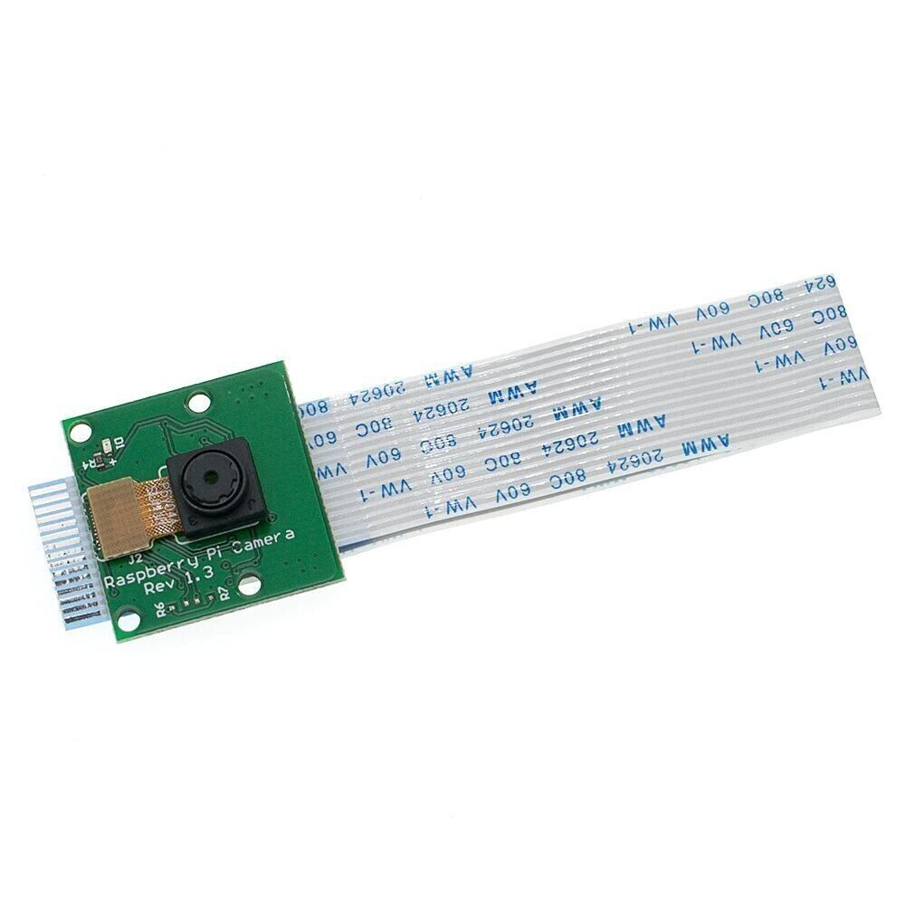

## E116 - Raspberry Pi Camera Rev 1.3

## Description    

Connect the Raspberry Pi Camera Module to your Raspberry Pi and take pictures, record video, and apply image effects.

## Library Options

| Status: | Inactive |
| Min Qty: | 0 |
| Layout | 15 Pin | 

## Technical Information

| Data Sheet: | [Data Sheet Raspberry Pi Camera Rev 1.3](https://docs.rs-online.com/2888/0900766b8127db0a.pdf) |
| Megapixels | 5 |
| Resolution | 2592 x 1944 |
| Image Transfer Rate | 1080p: 30fps, 720p: 60fps |
| Pin Layout: | 15 Pin |
| PCB Files: | None |
| CAD Files: | None |

## Supplier Information

| Supplier: | Adafruit |
| Part #: | 3099 |         
| Pkg Count: | 1 |
| Pkg Price: | $29.95 |

## Tips & Techniques

## Links
[Buy from Adafruit](https://www.adafruit.com/category/802)
